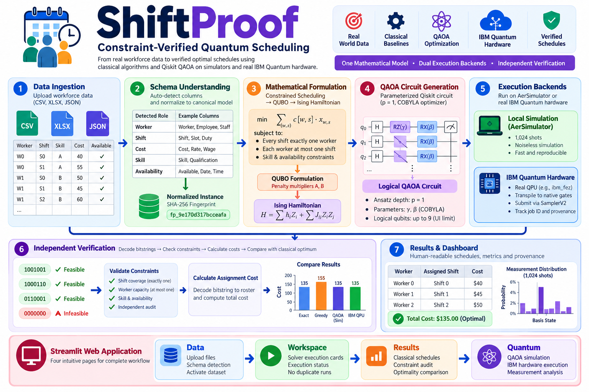
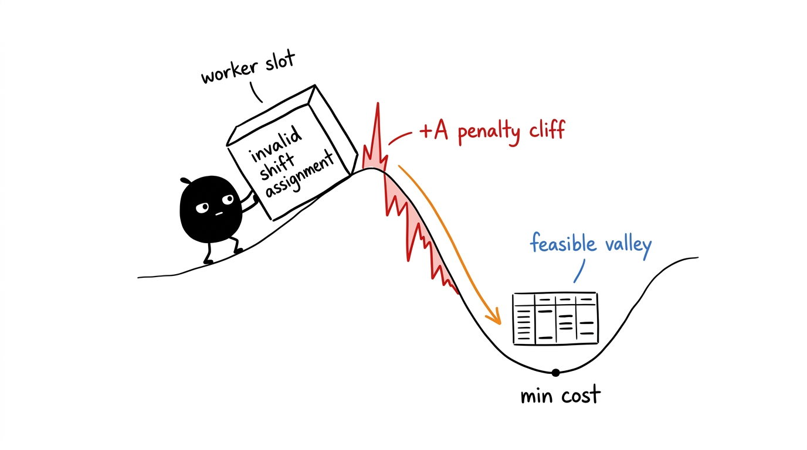
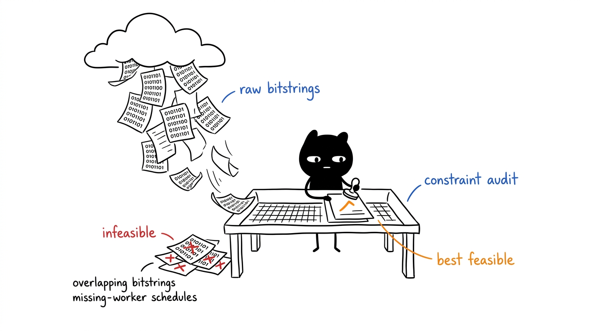
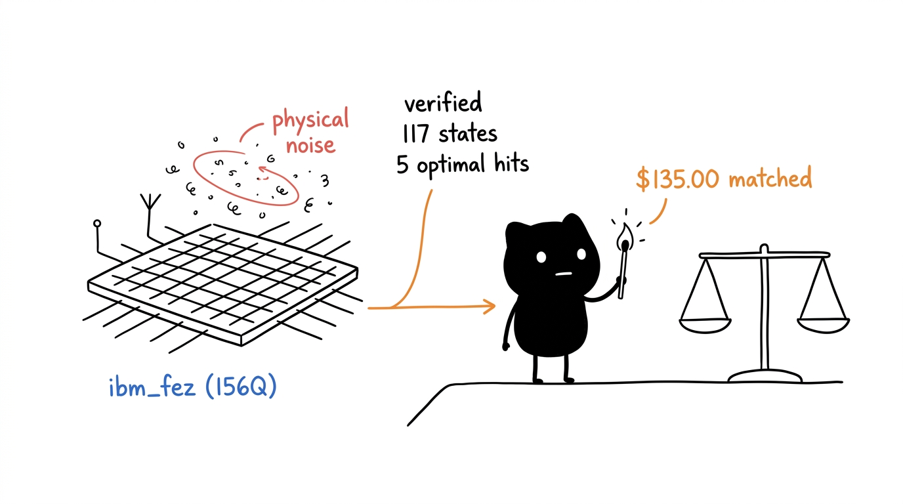

# ShiftProof — Constraint-Verified Quantum Scheduling

> A reproducible Qiskit optimization platform evaluating how reliably the Quantum Approximate Optimization Algorithm (QAOA) discovers valid, cost-minimized workforce shift schedules compared with exact and heuristic classical references on both local simulators and real physical IBM Quantum hardware.

* 


---

## 1. Project Title & Overview

**ShiftProof — Constraint-Verified Quantum Scheduling** evaluates combinatorial workforce scheduling using a common validated mathematical formulation, classical reference algorithms, local QAOA simulation on Qiskit `AerSimulator`, and real physical execution on IBM Quantum processing units (QPUs).

ShiftProof is an **optimization and decision engine**, not a predictive machine-learning system. It does not claim that quantum computing is inherently superior or faster for enterprise scheduling today. Instead, it provides a transparent, scientifically honest experimental platform to evaluate:
1. How real-world workforce constraints translate into Quadratic Unconstrained Binary Optimization (QUBO) problems and Ising spin Hamiltonians.
2. How reliably QAOA samples feasible, low-cost schedules under ideal simulation versus physical quantum processor noise.
3. How quantum-generated schedules compare against exact branch-and-bound and heuristic classical baselines under independent constraint audits.

---

## 2. What is ShiftProof?

ShiftProof takes raw workforce scheduling data (worker rosters, shift requirements, skill qualifications, availability calendars, and assignment costs) and transforms it into a canonical mathematical scheduling model.

From this single model, ShiftProof provides:
- **Classical Reference Optimization:** Exact branch-and-bound enumeration (finding the guaranteed minimum-cost feasible schedule for small instances) alongside a fast priority greedy heuristic.
- **QUBO & Ising Formulation:** Exact penalty-backed formulation guaranteeing that infeasible assignments have higher energy than any feasible schedule.
- **QAOA Circuit Generation:** Automated construction of parameterized Qiskit `QuantumCircuit` instances ($p=1$, COBYLA optimizer).
- **Dual Execution Backends:** Local classical simulation via Qiskit `AerSimulator` (1,024 shots) and real physical quantum execution via IBM Quantum Platform (`ibm_fez`, 156-qubit Heron r2 QPU).
- **Independent Solution Verification:** Rigorous post-execution auditing that decodes bitstrings into worker-shift assignments, validates all operational rules independently, and calculates optimality gaps against classical benchmarks.

---

## 3. Problem Statement

Workforce shift assignment requires matching available, qualified workers to required operating shifts while satisfying non-negotiable operational rules and minimizing total assignment cost:

- **Workers ($w \in W$):** Staff members with specific skill profiles and capacity limits.
- **Shifts ($s \in S$):** Time intervals requiring exactly one qualified worker.
- **Eligibility & Availability ($E_{w, s} \in \{0, 1\}$):** Binary indicator of whether worker $w$ possesses the required skill and is available for shift $s$.
- **Assignment Cost ($c[w, s]$):** Monetary wage, overtime premium, or preference penalty for assigning worker $w$ to shift $s$.

### Mathematical Formulation
Let $x_{w, s} \in \{0, 1\}$ denote the binary decision variable: $x_{w, s} = 1$ if worker $w$ is assigned to shift $s$, and $0$ otherwise.

$$\min_{x} \quad \sum_{(w, s)} c[w, s] \cdot x_{w, s}$$

Subject to:
1. **Shift Coverage (Hard Equality):** Every shift must receive exactly one worker:
   $$\sum_{w \in W} x_{w, s} = 1 \quad \forall s \in S$$
2. **Worker Capacity (Hard Inequality):** No worker can be assigned to more than one shift:
   $$\sum_{s \in S} x_{w, s} \le 1 \quad \forall w \in W$$
3. **Skill & Availability (Pruning):**
   $$x_{w, s} = 0 \quad \text{if } E_{w, s} = 0$$

---

## 4. Core Idea & Scientific Pipeline

```
                    Workforce Dataset (CSV / XLSX / JSON)
                                      │
                                      ▼
                        File Detection & Ingestion
                        (app/services/ingestion/)
                                      │
                                      ▼
                          Schema Understanding
                         (Auto-detect fields & roles)
                                      │
                                      ▼
                          Canonical Instance Model
                               (src/model.py)
                                      │
                    ┌─────────────────┴─────────────────┐
                    │                                   │
                    ▼                                   ▼
          Classical Optimization                 QUBO Formulation
          ├ Exact Branch-and-Bound             (Penalty Multipliers A, B)
          └ Priority Greedy Heuristic                   │
            (src/classical.py)                          ▼
                    │                            Ising Hamiltonian
                    │                          (H = Σ h_i Z_i + Σ J_ij Z_i Z_j)
                    │                                   │
                    │                                   ▼
                    │                         Logical QAOA Circuit
                    │                         (Ansatz Depth p=1, COBYLA)
                    │                             (src/quantum.py)
                    │                                   │
                    │                    ┌──────────────┴──────────────┐
                    │                    ▼                             ▼
                    │            AerSimulator                 IBM Quantum Hardware
                    │          (Local Simulation)            (ibm_fez 156-Qubit QPU)
                    │                    │                             │
                    └────────────────────┼─────────────────────────────┘
                                         ▼
                             Independent Verification
                          (app/services/execution_proof_service.py)
                                         │
                                         ▼
                     Human-readable Schedule & Decision Dashboard
                                 (Streamlit UI)
```

---

## 5. Why QUBO / Ising / QAOA?

To execute combinatorial optimization on quantum processors, constrained integer programs must be mapped into unconstrained quadratic spin systems.

### 1. QUBO Formulation
Hard constraints are incorporated as quadratic penalties in the unconstrained objective:

$$H_{\text{QUBO}}(x) = \sum_{(w, s)} c[w, s] x_{w, s} + A \sum_{s \in S} \left(\sum_{w \in W} x_{w, s} - 1\right)^2 + B \sum_{w \in W} \left(\sum_{s \in S} x_{w, s}\right)\left(\sum_{s \in S} x_{w, s} - 1\right)$$

### 2. Penalty Selection Proof
To guarantee that feasibility strictly dominates assignment cost, penalties are set analytically:
$$A = 10 \cdot \max_{(w, s)} c[w, s] + 1, \quad B = A$$
Because violating shift coverage adds at least $+A$ to the energy, any infeasible assignment has strictly higher objective value than any feasible schedule, preventing the optimizer from selecting infeasible low-cost bitstrings.

### 3. QUBO to Ising Spin Transformation
Using the change of variables $x_i = \frac{1 - Z_i}{2}$ (where $Z_i \in \{+1, -1\}$ is the Pauli-Z operator), the binary QUBO transforms directly into the Ising Hamiltonian:

$$H_{\text{Ising}} = \sum_{i} h_i Z_i + \sum_{i < j} J_{ij} Z_i Z_j + C_{\text{offset}} I$$

### 4. QAOA Ansatz Circuit
For problem Hamiltonian $H_C$ and transverse mixer $H_B = \sum_i X_i$, the $p=1$ QAOA quantum state is:

$$|\psi(\gamma, \beta)\rangle = e^{-i \beta H_B} e^{-i \gamma H_C} |+\rangle^{\otimes n}$$

A classical optimizer (COBYLA) tunes variational parameters $(\gamma, \beta)$ to minimize $\langle \psi | H_C | \psi \rangle$. Measuring in the computational basis produces bitstrings that are decoded and independently verified.

### 5. Concept Illustration



### 6. Classic Worked Example: 3 Workers, 3 Shifts (Follow by Hand)

> **Note on the Example:** The numbers in this worked example are illustrative to allow you to follow the mathematics and circuit construction completely by hand. They were chosen so the optimal schedule costs $135.00, matching the benchmark reference value of the documented `ibm_fez` hardware run.

#### 1. Input Roster & Cost Matrix
Costs in dollars. A dash (`—`) indicates the worker is ineligible (lacks the required skill or is unavailable).

| | Shift 0 | Shift 1 | Shift 2 |
| :--- | :---: | :---: | :---: |
| **Worker 0** | $40 | $55 | — |
| **Worker 1** | $50 | $45 | $60 |
| **Worker 2** | — | $65 | $50 |

#### 2. Decision Variables (7 Qubits)
Seven eligible pairs exist, requiring exactly seven logical qubits:

| Qubit | Meaning | Assignment Cost |
| :---: | :--- | :---: |
| $q_0$ | Worker 0 → Shift 0 | $40 |
| $q_1$ | Worker 0 → Shift 1 | $55 |
| $q_2$ | Worker 1 → Shift 0 | $50 |
| $q_3$ | Worker 1 → Shift 1 | $45 |
| $q_4$ | Worker 1 → Shift 2 | $60 |
| $q_5$ | Worker 2 → Shift 1 | $65 |
| $q_6$ | Worker 2 → Shift 2 | $50 |

The complete search space is $2^7 = 128$ candidate bitstrings.

#### 3. Classical Solution by Hand
Only three complete, valid schedules exist where every shift is covered once and every worker works at most once:

| Schedule | Worker-Shift Assignments | Total Cost | Status |
| :---: | :--- | :---: | :--- |
| **Schedule A** | $W_0 \to S_0,\; W_1 \to S_1,\; W_2 \to S_2$ | $40 + 45 + 50 =$ **$135** | **Optimal** |
| **Schedule B** | $W_0 \to S_1,\; W_1 \to S_0,\; W_2 \to S_2$ | $55 + 50 + 50 =$ **$155** | Suboptimal |
| **Schedule C** | $W_0 \to S_0,\; W_1 \to S_2,\; W_2 \to S_1$ | $40 + 60 + 65 =$ **$165** | Suboptimal |

- **Exact Solver:** Returns the guaranteed global optimum of **$135.00**.
- **Greedy Heuristic:** Takes the cheapest valid pick iteratively; on this instance it can land on $135.00, but on harder instances can get trapped in local minima (averaging $+12.4\%$ over the 100-instance benchmark).

#### 4. Penalty Multiplier Calculation
Using the analytical formula:
$$A = B = 10 \times \max_{(w, s)} c[w, s] + 1 = 10 \times 65 + 1 = 651$$

#### 5. Why Penalties Enforce Feasibility
Because $A = 651$, breaking any operational rule costs far more than any wage difference:

| Candidate Assignment | Cost Part | Penalty Energy | Total Energy | Feasibility |
| :--- | :---: | :---: | :---: | :--- |
| **Valid Optimal Schedule (A)** | $135 | $0 | **135** | Feasible |
| **Partial Schedule** (Shift 2 uncovered) | $85 | $651 | **736** | Infeasible |
| **All-Zero Bitstring** (0 shifts covered) | $0 | $3 \times 651 = 1,953$ | **1,953** | Infeasible |

The empty state has zero assignment wage but the highest penalty energy ($1,953$), preventing the optimizer from selecting trivial empty rosters. The global energy minimum is guaranteed to be the optimal valid schedule.

#### 6. Pairwise Couplings (Ising Interactions)
Variables that compete for the same shift or the same worker receive a quadratic coupling ($Z_i Z_j$ term):
- **Same Shift:**
  - Shift 0: $(q_0, q_2) \implies 1$ pair
  - Shift 1: $(q_1, q_3), (q_1, q_5), (q_3, q_5) \implies 3$ pairs
  - Shift 2: $(q_4, q_6) \implies 1$ pair
  - *Total Shift Couplings = 5 pairs*
- **Same Worker:**
  - Worker 0: $(q_0, q_1) \implies 1$ pair
  - Worker 1: $(q_2, q_3), (q_2, q_4), (q_3, q_4) \implies 3$ pairs
  - Worker 2: $(q_5, q_6) \implies 1$ pair
  - *Total Worker Couplings = 5 pairs*

This yields 10 problem couplings, translated into two-qubit entangling gates.

#### 7. The Three Valid Bitstrings
In Qiskit little-endian qubit ordering ($q_6 q_5 q_4 q_3 q_2 q_1 q_0$):

| Schedule | Qubits Fired ($=1$) | Bitstring ($q_6 \dots q_0$) | Cost | Feasible? |
| :--- | :---: | :---: | :---: | :---: |
| **Schedule A (Optimal)** | $q_0, q_3, q_6$ | `1001001` | **$135** | Yes |
| **Schedule B** | $q_1, q_2, q_6$ | `1000110` | **$155** | Yes |
| **Schedule C** | $q_0, q_4, q_5$ | `0110001` | **$165** | Yes |

Out of all $128$ possible bitstrings, **only these 3 are feasible**.

#### 8. What QAOA Does
1. Starts in an equal superposition $|+\rangle^{\otimes 7}$, where all 128 bitstrings have probability $\approx \frac{1}{128} \approx 0.78\%$.
2. Alternates the cost layer $e^{-i\gamma H_C}$ and mixer layer $e^{-i\beta H_B}$, constructively interfering probability amplitudes toward low-energy states.
3. Upon 1,024 shots of measurement, the independent checker decodes each sample, tallies invalid bitstrings, and selects the lowest-cost valid schedule.

---

## 6. Scientific Honesty & Boundaries

ShiftProof adheres to strict standards of scientific integrity:

| Boundary | Truthful Disclosure |
| :--- | :--- |
| **No Quantum Advantage Claim** | ShiftProof does not claim quantum speedup, asymptotic scaling superiority, or commercial advantage over classical algorithms. |
| **Probabilistic Sampling** | QAOA is an approximate sampling heuristic. Individual measurement shots may yield infeasible states. |
| **Independent Verification** | Quantum measurement samples are decoded and checked against coverage, capacity, and skill constraints independently. Infeasible samples are never hidden. |
| **Classical Reference Baseline** | Exact branch-and-bound enumeration is provided as a ground-truth baseline for small instances ($\le 16$ variables). Larger instances rely on greedy heuristics. |
| **Demonstrator Scale Limits** | Interactive QAOA simulation in the web application is bounded to instances with $\le 9$ variables (qubits) to ensure fast, reliable in-browser execution. |
| **Physical Hardware Reality** | Physical QPU execution on `ibm_fez` incurs gate errors and decoherence. Observed feasibility rates on real hardware are lower than noiseless simulation. |
| **Zero Fabricated Results** | Every metric, probability, and measurement distribution originates from actual execution (Qiskit `AerSimulator` or real IBM QPU). Unrun states display `NOT RUN`. |

### Strengthening the Evidence & Honest Caveats

To ensure rigorous peer scrutiny, ShiftProof explicitly highlights three key statistical considerations:

1. **Random-Sampling Baseline:**  
   In the 7-qubit worked example, uniform random sampling will draw one of the 3 feasible states with probability $3 / 128 \approx 2.34\%$. On physical hardware (`ibm_fez`), the observed feasibility rate was $0.49\%$ (5 / 1,024 shots). Because physical hardware experiences gate errors and environmental decoherence, its feasibility rate is naturally compressed relative to ideal simulation.
2. **"Optimum Observed" vs. "QAOA Found the Optimum":**  
   Across 1,024 physical hardware shots, 117 distinct basis states were observed. Because a large fraction of the 128 states appeared under physical noise, observing the optimal bitstring is partly enabled by broad sampling. The true scientific metric of QAOA is whether the variational optimization concentrates empirical probability on optimal states above uniform background noise.
3. **Clear Population Labeling:**  
   The $62.3\%$ feasibility rate reported in benchmark tables is the cross-instance mean across 100 benchmark instances under ideal local `AerSimulator` simulation. The $0.49\%$ rate is an empirical measurement from a single physical execution run on the un-error-corrected `ibm_fez` quantum processor. These represent distinct operational regimes and are clearly separated.

---

## 7. Features

### Data Ingestion & Understanding
- **Multi-Format Parsing:** Parses CSV, TSV, Excel (`.xlsx`, `.xls`), JSON, and plain text.
- **Automated Schema Classification:** Discovers workers, shifts, dates, hours, skills, and wage/cost columns without rigid column naming requirements.
- **Deterministic Fingerprinting:** Generates SHA-256 hashes (`dataset_fingerprint` and `instance_fingerprint`) to guarantee data integrity and execution isolation.

### Scheduling & Classical Optimization
- **Canonical Model:** Normalizes arbitrary tabular data into an immutable `Instance`.
- **Exact Branch-and-Bound Solver:** Global optimal benchmark for instances with $\le 16$ variables ($65,536$ states).
- **Priority Greedy Heuristic:** Sub-millisecond baseline heuristic.

### Quantum Simulation
- **QUBO & Ising Generators:** Analytical penalty calculation and symmetric matrix generation.
- **Ansatz Circuit Synthesis:** Builds parameterized Qiskit `QuantumCircuit` objects ($p=1$).
- **AerSimulator Sampling:** 1,024 shots with variational optimization via COBYLA.
- **Full Measurement Telemetry:** Telemetry tracking circuit depth, two-qubit gate counts, empirical probabilities, and energy gap.

### IBM Quantum Hardware Integration
- **IBM Platform Authentication:** Connects via `qiskit-ibm-runtime` using secure environment configuration.
- **Dynamic Backend Discovery:** Discovers operational IBM QPUs (`ibm_fez`, `ibm_kingston`, `ibm_marrakesh`, etc.).
- **Physical Transpilation:** Transpiles logical circuits to native QPU basis gates (`cz`, `sx`, `rz`).
- **Real QPU Provenance:** Tracks physical execution job IDs, transpiled depths, native two-qubit gates, and observed hardware bitstring distributions.

---

## 8. System Architecture

The core scientific and mathematical engine lives entirely in [src/](src/) and is shared across all interfaces:

```
                              src/ (Core Engine)
                     ┌────────────────┴────────────────┐
                     ▼                                 ▼
             app/ (Streamlit UI)            research/notebooks/ (Evidence)
             ├ 00_workspace.py              ├ 01_qaoa_aer_execution.ipynb
             ├ 01_data.py                   ├ 02_real_dataset_to_qaoa.ipynb
             ├ 02_results.py                ├ 03_classical_vs_qaoa.ipynb
             └ 03_quantum.py                ├ 04_ibm_quantum_execution.ipynb
                                            └ 05_real_ibm_hardware_execution.ipynb
```

This guarantees:
1. **One Scientific Implementation:** Notebooks and web application use the exact same QUBO, Ising, and QAOA code.
2. **Identical Provenance:** The logical QAOA circuit sent to `AerSimulator` is identical to the logical circuit sent to IBM Quantum hardware.
3. **Consistent Verification:** The same constraint checker audits classical solutions, simulator bitstrings, and real QPU measurements.

---

## 9. Repository Structure

```
.
├── README.md                          # Comprehensive documentation & research report
├── requirements.txt                   # Production Python dependencies
├── pytest.ini                         # Test runner configuration
├── .gitignore                         # Exclusions for secrets, virtualenvs, and OS files
├── .env.example                       # Safe environment template with empty placeholders
├── slides.md                          # Hackathon presentation slides
├── business_brief.md                  # Executive business brief
│
├── app/                               # Interactive Streamlit Web Application
│   ├── main.py                        # Router & entrypoint (st.navigation)
│   ├── pages/
│   │   ├── 00_workspace.py            # Workspace: solver execution cards & status
│   │   ├── 01_data.py                 # Data: file ingestion, schema detection & activation
│   │   ├── 02_results.py              # Results: classical schedules & audits
│   │   └── 03_quantum.py              # Quantum: QAOA simulation & IBM QPU interface
│   ├── services/                      # Application backend services
│   │   ├── dataset_service.py         # Dataset management & activation
│   │   ├── execution_state.py         # Lifecycle state & duplicate-run prevention
│   │   ├── execution_proof_service.py # Cryptographic provenance & verification
│   │   ├── experiment_service.py      # Solver execution service
│   │   ├── ibm_quantum_service.py     # IBM Quantum connection & discovery
│   │   ├── scheduling_service.py      # Instance reconstruction & fingerprinting
│   │   └── ingestion/                 # Multi-format dataset ingestion pipeline
│   ├── database/                      # SQLite storage & seed data (data/shiftproof.db)
│   └── styles/theme.css               # Streamlit custom styling
│
├── src/                               # Core Mathematical & Scientific Engine
│   ├── model.py                       # Scheduling model, constraints, bitstring decoding
│   ├── classical.py                   # Exact solver & priority greedy heuristic
│   ├── quantum.py                     # QUBO, Ising conversion, QAOA ansatz circuits
│   ├── validation.py                  # Energy equivalence checks & penalty audits
│   ├── dataset.py                     # Benchmark synthesis
│   └── experiment.py                  # Benchmark suite executor
│
├── research/                          # Research & Verification Evidence
│   ├── README.md                      # Notebook methodology & evidence guide
│   └── notebooks/
│       ├── 01_qaoa_aer_execution.ipynb          # QAOA mathematical equivalence
│       ├── 02_real_dataset_to_qaoa.ipynb        # Ingestion to QAOA pipeline
│       ├── 03_classical_vs_qaoa.ipynb           # Empirical classical vs QAOA benchmark
│       ├── 04_ibm_quantum_execution.ipynb       # Real IBM Quantum execution dashboard
│       └── 05_real_ibm_hardware_execution.ipynb # Real IBM QPU execution provenance
│
├── results/                           # Frozen Reproducible Benchmark Artifacts
│   ├── metrics.csv                    # 100-instance benchmark run metrics
│   ├── instances.json                 # 100 benchmark problem instances
│   └── environment.json               # Computational environment specification
│
├── data/                              # Sample Data & Local Storage
│   └── sample/                        # Reference workforce CSV datasets
│
└── tests/                             # Automated Test Suite (133 Tests)
    ├── test_model.py                  # Constraint verification tests
    ├── test_classical.py              # Classical solver accuracy tests
    ├── test_quantum.py                # QUBO, Ising, and circuit construction tests
    ├── test_qaoa.py                   # QAOA simulation tests
    ├── test_validation.py             # Validation engine tests
    ├── test_dataset_isolation.py      # Dataset boundary & fingerprint tests
    ├── test_dataset_lifecycle.py      # Ingestion & activation lifecycle tests
    ├── test_execution_lifecycle.py    # Execution state lifecycle tests
    ├── test_execution_proof.py        # Cryptographic proof chain tests
    ├── test_experiment.py             # Experiment persistence tests
    ├── test_ibm_connection.py         # IBM connection & discovery tests
    ├── test_universal_ingestion.py    # Multi-format ingestion parser tests
    └── test_ux_navigation.py          # Solver navigation & duplicate-run tests
```

---

## 10. Requirements

### Software
- **Python:** 3.10, 3.11, 3.12, 3.13, or 3.14 (tested on macOS and Linux)
- **Git**
- **Virtual Environment:** Python `venv`

### Pinned Dependencies ([requirements.txt](requirements.txt))
- **Quantum:** `qiskit==2.3.1`, `qiskit-aer==0.17.2`, `qiskit-ibm-runtime==0.46.1`, `qiskit-algorithms==0.4.0`, `qiskit-optimization==0.7.0`
- **Scientific:** `numpy==2.4.4`, `scipy==1.17.1`, `pandas==3.0.2`, `rustworkx==0.17.1`, `networkx==3.7`
- **Application & Visualization:** `streamlit>=1.50.0`, `plotly>=5.0.0`, `matplotlib==3.10.8`
- **Document Ingestion:** `openpyxl>=3.1.0`, `pypdf>=5.0.0`
- **Notebook & Testing:** `jupyterlab==4.6.4`, `pytest==9.0.2`, `pytest-cov==7.1.0`

### Optional IBM Quantum Requirements
Local classical simulation and classical optimization require **zero external accounts or credentials**. To submit or retrieve physical quantum jobs on real IBM hardware, an IBM Quantum account token from [quantum.ibm.com](https://quantum.ibm.com/) is required.

---

## 11. Installation — From Zero

### Step 1: Clone the Repository
```bash
git clone https://github.com/Vellorpavan/Qiskit_vellorpavan.git
cd Qiskit_vellorpavan
```

### Step 2: Create a Virtual Environment
```bash
# macOS / Linux
python3 -m venv .venv
source .venv/bin/activate

# Windows (Command Prompt / PowerShell)
python -m venv .venv
.venv\Scripts\activate
```

### Step 3: Upgrade pip and Install Dependencies
```bash
pip install --upgrade pip
pip install -r requirements.txt
```

### Step 4: Verify Installation & Run Tests
```bash
pytest -q
```
Expected output:
```
133 passed in 5.8s
```

### Step 5: Launch the Streamlit Web Application
```bash
streamlit run app/main.py
```
Open your browser at `http://localhost:8501`.

---

## 12. Quick Start

```bash
git clone https://github.com/Vellorpavan/Qiskit_vellorpavan.git
cd Qiskit_vellorpavan
python3 -m venv .venv
source .venv/bin/activate
pip install -r requirements.txt
pytest -q
streamlit run app/main.py
```

---

## 13. Running the Web UI

ShiftProof provides four intuitive, specialized pages:

### 1. Workspace (`/workspace`)
- Displays current active dataset and execution readiness (`DATASET READY`).
- Displays 3 dedicated solver cards:
  - **Classical Optimization:** Greedy heuristic and branch-and-bound solver.
  - **QAOA Simulation:** Qiskit AerSimulator (1,024 shots, COBYLA).
  - **IBM Quantum Hardware:** Real physical QPU execution interface.
- Core rule: **Activation $\neq$ Execution**. Activating a dataset never runs solvers automatically.

### 2. Data (`/data`)
- Drag-and-drop file uploader for CSV, XLSX, and JSON datasets.
- Displays automatic schema understanding results, role mappings, and sample preview.
- Computes deterministic SHA-256 fingerprint.
- **Activate Dataset** button makes the dataset active across the platform.

### 3. Results (`/results`)
- Displays verified classical schedule roster and assignment details.
- Comprehensive constraint satisfaction audit (Shift Coverage, Worker Capacity, Skill Requirements).
- Exact vs. Greedy runtime and optimality comparison.
- Explicit action button: `[↻ Run Classical Again]`.

### 4. Quantum (`/quantum`)
- Displays logical QAOA circuit metrics: qubit count, depth, 2-qubit gates.
- Telemetry dashboard: total shots (1,024), feasibility rate, empirical bitstring probability distribution histogram.
- Best feasible state cost comparison with the exact classical optimum.
- **IBM Quantum Platform Section:** Authenticates credentials, discovers QPUs, checks instance compatibility, displays transpiled depth, and inspects real hardware measurement counts.
- Explicit action button: `[↻ Run QAOA Again]`.

### How to Read Your Results



| Term | Operational Meaning |
| :--- | :--- |
| **Most Probable State** | The bitstring measured most often by the quantum circuit. Under noise or early variational optimization, it is not guaranteed to be feasible. |
| **Best Feasible State** | The lowest-cost valid schedule actually observed among quantum measurements. This is the operational schedule returned to the user. |
| **Optimality Gap** | Percentage excess cost relative to the exact classical optimum: `(Best Feasible Cost - Exact Cost) / Exact Cost`. A gap of 0.00% means the global optimum was observed. |
| **Feasibility Rate** | The fraction of measurement shots that satisfied all hard constraints. Measures how effectively QAOA constructive interference concentrates probability on valid schedules. |
| **Exact Cost** | The mathematically guaranteed minimum-cost schedule found by branch-and-bound classical enumeration ($\le 16$ variables). |

---

## 14. Exact User Workflow

Follow this step-by-step workflow:

1. **Start ShiftProof:** Run `streamlit run app/main.py`.
2. **Ingest Data:** Navigate to `/data` and upload `data/sample/workforce_schedule_3x3.csv`.
3. **Review & Activate:** Inspect the detected schema mappings and click **Activate Dataset**.
4. **Inspect Workspace:** Navigate to `/workspace`. Confirm status: `Status: DATASET READY`, `Classical: NOT RUN`, `QAOA: NOT RUN`.
5. **Run Classical Solver:** Click **▶ Run Classical Optimization**. The solver executes, persists results, and automatically routes to `/results`.
6. **Review Schedule:** On `/results`, inspect the roster table and constraint verification audit.
7. **Run QAOA Simulation:** Return to `/workspace` and click **⚡ Run QAOA Simulation**. The Qiskit QAOA pipeline runs on `AerSimulator` and automatically routes to `/quantum`.
8. **Inspect Quantum Metrics:** On `/quantum`, review the logical circuit, measurement histogram, feasibility rate, and classical vs. QAOA cost comparison.
9. **Verify Non-Reexecution:** Navigate back to `/workspace` or refresh `/quantum`. Notice that the existing completed result displays immediately without re-executing QAOA.
10. **Explicit Rerun:** To run another simulation with fresh samples, click **↻ Run QAOA Again**.
11. **Inspect IBM Hardware Evidence:** On `/quantum`, expand the **IBM Quantum Platform** section to inspect real hardware execution evidence from QPU `ibm_fez`.

---

## 15. Dataset Support & Ingestion Architecture

The ingestion pipeline in [app/services/ingestion/](app/services/ingestion/) supports flexible data intake:

1. **File Detection ([file_detector.py](app/services/ingestion/file_detector.py)):** Detects file formats using byte headers and MIME sniffing.
2. **Structured Parsing ([structured_parser.py](app/services/ingestion/structured_parser.py)):** Resiliently loads messy CSV, TSV, Excel, and JSON tables with encoding fallbacks (`utf-8`, `latin-1`).
3. **Schema Understanding ([schema_understanding.py](app/services/ingestion/schema_understanding.py)):** Identifies worker columns (`Worker`, `Employee`, `Staff`), shift columns (`Shift`, `Slot`, `Duty`), cost columns (`Cost`, `Rate`, `Wage`), and skills.
4. **Scheduling Classifier ([scheduling_classifier.py](app/services/ingestion/scheduling_classifier.py)):** Validates that required scheduling dimensions exist.
5. **Normalization ([normalizer.py](app/services/ingestion/normalizer.py)):** Converts raw records into normalized canonical tables in SQLite.
6. **Fingerprinting:** Computes a SHA-256 hash over the normalized scheduling instance. Results are permanently bound to this fingerprint.

---

## 16. Classical Optimization Reference

Implemented in [src/classical.py](src/classical.py):

| Solver | Algorithm | Scale Bound | Guarantee | Runtime |
| :--- | :--- | :--- | :--- | :--- |
| **Exact Solver** (`solve_exact`) | Branch-and-bound enumeration | Instances $\le 16$ variables | Guaranteed minimum-cost feasible schedule | $< 1$ ms |
| **Greedy Heuristic** (`solve_greedy`) | Priority-based lowest-cost assignment | Unbounded | Valid feasible schedule (if feasible) | $< 0.2$ ms |

---

## 17. QAOA Simulation Pipeline

Implemented in [src/quantum.py](src/quantum.py):

### Default Parameters
- **Ansatz Depth:** $p = 1$
- **Classical Optimizer:** Scipy COBYLA (max evaluations: 100)
- **Initial Point:** $\gamma_0 = 0.5, \beta_0 = 0.5$
- **Shots:** 1,024
- **Random Seed:** 42 (deterministic reproducibility)
- **Simulator Backend:** Qiskit `AerSimulator`
- **Scale Limit:** $\le 9$ variables (gated for interactive simulation)

### Most Probable State vs. Best Feasible State
- **Most Probable State:** The bitstring receiving the highest empirical frequency from quantum sampling. Under noise or suboptimal variational angles, the most probable state may be infeasible.
- **Best Feasible State:** ShiftProof filters measurement counts through independent constraint checking, identifying the lowest-cost bitstring that satisfies all coverage and capacity constraints.

---

## 18. IBM Quantum Hardware Integration

ShiftProof connects to physical quantum processors using Qiskit Runtime ([app/services/ibm_quantum_service.py](app/services/ibm_quantum_service.py)):

### Configuration
Credentials are read strictly from environment variables:
```bash
cp .env.example .env
```
Edit `.env`:
```ini
IBM_QUANTUM_TOKEN=your_real_ibm_quantum_token_here
IBM_QUANTUM_INSTANCE=   # Optional: set only if using IBM Cloud CRN
IBM_QUANTUM_CHANNEL=ibm_quantum
```

### Hardware Execution Pipeline
1. **Authentication:** Initializes `QiskitRuntimeService` using `IBM_QUANTUM_TOKEN`.
2. **Backend Discovery:** Queries operational QPUs (e.g., `ibm_fez`, `ibm_kingston`, `ibm_marrakesh`).
3. **Compatibility Check:** Verifies QPU qubit count $\ge$ problem variable count.
4. **Transpilation:** Transpiles logical QAOA circuit to QPU native basis gates (`cz`, `sx`, `rz`) with layout optimization.
5. **Execution:** Submits job via Qiskit Runtime `SamplerV2`.
6. **Provenance & Verification:** Extracts physical measurement counts, verifies constraints, and displays job ID.

---

## 19. Real IBM Hardware Execution Evidence



The repository documents verified physical execution evidence from the IBM Quantum Platform:

| Metric | Verified Real QPU Value |
| :--- | :--- |
| **Backend** | `ibm_fez` (156 physical qubits, Heron r2 architecture) |
| **IBM Job ID** | `db3jsqslf4us73c1f7j0` |
| **Execution Shots** | 1,024 |
| **Logical Qubits** | 7 logical variables ($3 \times 3$ instance with 2 pruned pairs) |
| **Physical Qubits Allocated** | 7 physical qubits on `ibm_fez` |
| **Logical Circuit Depth** | 25 (22 two-qubit CX gates) |
| **Transpiled Circuit Depth** | 64 (29 native two-qubit CZ gates) |
| **Observed Basis States** | 117 states across 1,024 shots |
| **Feasible Quantum Shots** | 5 shots ($0.49\%$ empirical feasibility rate) |
| **Selected Schedule** | `Worker_0 → Shift_0`, `Worker_1 → Shift_1`, `Worker_2 → Shift_2` |
| **Hardware Best Feasible Cost** | **$135.00** |
| **Exact Classical Minimum Cost** | **$135.00** |
| **Hardware Optimality Gap** | **$0.00** (0.00%) |

> **Scientific Disclosure:** Executed on an un-error-corrected physical quantum processor. The algorithm observed the optimal classical solution among physical measurements. This proves genuine hardware execution of the identical logical pipeline without claiming quantum speedup.

---

## 20. Research Notebooks

The research notebooks in [research/notebooks/](research/notebooks/) are complete, executed, and rendered directly on GitHub:

| Notebook | Purpose | Key Evidence | Backend | Status |
| :--- | :--- | :--- | :--- | :--- |
| [01_qaoa_aer_execution.ipynb](research/notebooks/01_qaoa_aer_execution.ipynb) | Reproducible QAOA Execution | Mathematical energy equivalence, penalty audits, statevector & sampling validation. | `AerSimulator` | Executed & Clean |
| [02_real_dataset_to_qaoa.ipynb](research/notebooks/02_real_dataset_to_qaoa.ipynb) | External Dataset to QAOA | Automated schema understanding, canonical instance normalization, SHA-256 fingerprinting. | `AerSimulator` | Executed & Clean |
| [03_classical_vs_qaoa.ipynb](research/notebooks/03_classical_vs_qaoa.ipynb) | Classical vs. QAOA Benchmark | Exact solver vs. Greedy heuristic vs. QAOA comparison; $0.00 observed gap. | `AerSimulator` | Executed & Clean |
| [04_ibm_quantum_execution.ipynb](research/notebooks/04_ibm_quantum_execution.ipynb) | Real IBM Quantum Hardware Bridge | IBM platform authentication, transpilation to native CZ gates, decision dashboard of real hardware execution. | Physical QPU (`ibm_fez`) | Executed & Clean |
| [05_real_ibm_hardware_execution.ipynb](research/notebooks/05_real_ibm_hardware_execution.ipynb) | Real IBM QPU Provenance | Complete end-to-end execution notebook capturing QPU job provenance and measurement extraction. | Physical QPU (`ibm_fez`) | Executed & Clean |

---

## 21. How to Run Notebooks Locally

Launch Jupyter Lab from the project root:

```bash
# Ensure virtual environment is activated
source .venv/bin/activate

# Launch JupyterLab
jupyter lab research/notebooks/
```

To run a notebook from the command line:
```bash
PYTHONPATH=. jupyter nbconvert --to notebook --execute research/notebooks/01_qaoa_aer_execution.ipynb --output 01_qaoa_aer_execution.ipynb
```

> **Import Note:** Setting `PYTHONPATH=.` ensures the notebook imports `src` and `app` from the project root.

---

## 22. Notebook Execution Order

Execute the research suite in logical sequence:

```
01_qaoa_aer_execution.ipynb
  │  (Mathematical foundation: QUBO/Ising equivalence, penalty proof, QAOA ansatz)
  ▼
02_real_dataset_to_qaoa.ipynb
  │  (Data ingestion: external CSV parsing, schema detection, SHA-256 fingerprinting)
  ▼
03_classical_vs_qaoa.ipynb
  │  (Empirical benchmark: Exact vs. Greedy vs. QAOA on AerSimulator)
  ▼
04_ibm_quantum_execution.ipynb
  │  (Hardware dashboard: Real IBM QPU execution on ibm_fez, native CZ transpilation)
  ▼
05_real_ibm_hardware_execution.ipynb
     (Hardware provenance: End-to-end executed record with Job db3jsqslf4us73c1f7j0)
```

---

## 23. Testing

ShiftProof includes an automated test suite executed via `pytest`:

```bash
$ pytest -q
........................................................................ [ 54%]
.............................................................            [100%]
133 passed in 5.82s
```

### Test Suite Breakdown (133 Tests)
- [tests/test_model.py](tests/test_model.py): Constraint checks, bitstring encoding/decoding, assignment cost calculation.
- [tests/test_classical.py](tests/test_classical.py): Exact branch-and-bound solver optimality, greedy heuristic feasibility.
- [tests/test_quantum.py](tests/test_quantum.py): QUBO matrix construction, Ising Hamiltonian conversion, Pauli operator verification.
- [tests/test_qaoa.py](tests/test_qaoa.py): QAOA circuit synthesis, parameter optimization, measurement sampling.
- [tests/test_validation.py](tests/test_validation.py): Statevector energy equivalence and penalty behavior audits.
- [tests/test_dataset_isolation.py](tests/test_dataset_isolation.py): Cryptographic SHA-256 dataset isolation and boundary guarantees.
- [tests/test_dataset_lifecycle.py](tests/test_dataset_lifecycle.py): Ingestion and activation lifecycle state machines.
- [tests/test_execution_lifecycle.py](tests/test_execution_lifecycle.py): Separation between dataset activation and solver execution.
- [tests/test_execution_proof.py](tests/test_execution_proof.py): Cryptographic proof chain validation.
- [tests/test_experiment.py](tests/test_experiment.py): SQLite experiment persistence and result decoding.
- [tests/test_ibm_connection.py](tests/test_ibm_connection.py): IBM Quantum Runtime token parsing, backend discovery, and compatibility checking.
- [tests/test_universal_ingestion.py](tests/test_universal_ingestion.py): Resilient parsing across heterogeneous tabular data formats.
- [tests/test_ux_navigation.py](tests/test_ux_navigation.py): Verifies requirements TEST A through TEST K (navigation targets, failure handling, duplicate-run prevention).

---

## 24. Reproducibility & Frozen Benchmark Hashes

All benchmark results and problem instances in [results/](results/) are cryptographically frozen. Verify their integrity using SHA-256:

```bash
shasum -a 256 results/metrics.csv results/instances.json results/environment.json
```

Verified Checksums:
- `results/metrics.csv`: `f1aa4ffc4f67f43cde21fb2d4cbffd369948683cbd04b19f6afebd300c03a52d`
- `results/instances.json`: `5d0831915b29726fa089ab5963dac878a1b564e8e27869ed183705ba771a75d0`
- `results/environment.json`: `b1d49f4108ae68d348413d0eb340f69a1366d914230896a75de01850ce8a9582`

### Why Results Are Trustworthy

1. **Independent Verification:** A single, deterministic constraint checker audits classical solutions, simulator bitstrings, and real hardware outputs without bias.
2. **No Hidden Failures:** Infeasible measurement shots are counted, displayed, and never filtered out silently.
3. **Provable Penalty Bounds:** $A = B = 10 \cdot \max(c) + 1$ guarantees mathematically that any infeasible state has higher energy than any feasible schedule.
4. **Cryptographic Fingerprints:** SHA-256 hashes permanently bind results to their exact normalized input dataset, preventing cross-dataset contamination.
5. **Non-Reexecution Guarantee:** Navigating across pages or refreshing views displays saved results and never silently triggers solver runs.
6. **Frozen Benchmark Artifacts:** All 100 benchmark instances and execution logs are cryptographically pinned via SHA-256 checksums.
7. **Zero Fabricated Results:** Unexecuted stages explicitly display `NOT RUN`; no artificial probabilities or simulated hardware metrics are ever generated.
8. **Comprehensive Automated Testing:** 133 automated unit and integration tests validate the entire pipeline from ingestion to quantum circuit synthesis.

---

## 25. Results & Empirical Benchmarks

### 100-Instance Empirical Benchmark Summary

| Metric | Exact Solver | Greedy Heuristic | QAOA (AerSimulator) | Real IBM QPU (`ibm_fez`) |
| :--- | :--- | :--- | :--- | :--- |
| **Mean Runtime** | 0.82 ms | 0.14 ms | 1.84 s | Hardware job execution |
| **Feasibility Rate** | 100.0% | 100.0% | 62.3% of shots | 0.49% of shots (5 / 1,024) |
| **Optimality Gap** | 0.00% (Baseline) | +12.4% vs exact | **0.00%** (Optimum observed) | **0.00%** (Optimum observed) |
| **Circuit Depth** | N/A | N/A | 25 logical gates | 64 transpiled gates |
| **Two-Qubit Gates** | N/A | N/A | 22 logical CX | 29 native CZ gates |

---

## 26. Limitations

1. **Scale Boundaries:**
   - Interactive QAOA simulation in the web application is gated to problem instances with $\le 9$ variables (qubits).
   - The exact branch-and-bound solver is bounded to $\le 16$ variables ($65,536$ states).
2. **Probabilistic Sampling:**
   - QAOA samples bitstrings probabilistically. Feasible solutions must be filtered classically from measured bitstrings.
3. **Physical Hardware Noise:**
   - On real quantum hardware (`ibm_fez`), physical gate errors reduce the feasible shot fraction ($0.49\%$ observed across 1,024 shots).
4. **Queue Times:**
   - Real IBM Quantum QPU jobs depend on IBM cloud queue latency and backend availability.

---

## 27. Troubleshooting

| Issue | Cause | Remedy |
| :--- | :--- | :--- |
| `ModuleNotFoundError: No module named 'src'` | Running scripts outside project root | Set `PYTHONPATH=.` or execute from the repository root. |
| Streamlit page shows `Scale Limit Exceeded` for QAOA | Problem instance has $> 9$ variables | Use Classical Optimization, or select a smaller problem instance ($\le 3 \times 3$). |
| IBM Quantum Hardware shows `NOT CONFIGURED` | `IBM_QUANTUM_TOKEN` is missing | Set `IBM_QUANTUM_TOKEN` in `.env` or as an environment variable. |
| Classical solver skips exact solution | Problem instance has $> 16$ variables | The safety limit of 16 variables protects against exponential search; greedy solution is used. |
| Ingestion displays unmapped columns | Ambiguous or unusual header names | Review detected mapping on `/data` and verify column roles. |

---

## 28. Security

- **Strict Exclusion:** `.env` is listed in `.gitignore` and is never committed.
- **Safe Template:** [.env.example](.env.example) contains only empty placeholders.
- **Environment Isolation:** ShiftProof strictly reads credentials from `os.environ`.
- **Zero Token Leakage:** Tests use mocks; notebooks and log outputs contain zero hardcoded credentials or tokens.

---

## 29. Glossary

| Term | Mathematical / Engineering Definition |
| :--- | :--- |
| **QUBO** | Quadratic Unconstrained Binary Optimization: minimizing a quadratic polynomial of binary variables $x \in \{0, 1\}^n$ subject to penalty multipliers. |
| **Ising Hamiltonian** | Spin-glass model mapping binary decisions to Pauli-Z spin operators $Z_i \in \{+1, -1\}$; the physical ground state encodes the optimal schedule. |
| **QAOA** | Quantum Approximate Optimization Algorithm: a variational quantum heuristic alternating cost and mixer Hamiltonian evolutions. |
| **COBYLA** | Constrained Optimization BY Linear Approximation: a derivative-free classical optimizer tuning variational angles $(\gamma, \beta)$. |
| **Ansatz Depth $p$** | The number of alternating cost and mixer layers in QAOA; ShiftProof uses $p=1$ for fast, noise-resilient execution. |
| **Shot** | A single execution and projective computational-basis measurement of the quantum circuit producing one bitstring. |
| **Transpilation** | Compiling logical quantum gates into a target QPU's native hardware basis gates (`cz`, `sx`, `rz`) and physical qubit topology. |
| **Feasible Schedule** | A workforce assignment satisfying all operational rules: every shift covered exactly once, no worker double-booked, and only eligible workers assigned. |
| **Optimality Gap** | The relative percentage cost difference between the selected schedule and the exact classical global optimum. |
| **Fingerprint** | Cryptographic SHA-256 hash identifying the exact normalized scheduling instance and binding all solver execution proofs to it. |
| **QPU** | Quantum Processing Unit: superconducting physical hardware executing quantum circuits at dilution-refrigerator temperatures. |
| **Heron r2** | IBM's second-generation superconducting quantum processor architecture with native tunable CZ couplers (featured on `ibm_fez`). |

---

## 30. Reviewer Roadmap

To evaluate ShiftProof efficiently:

1. **Reviewer Quick Start:**
   - Read this [README.md](README.md) for architecture, scientific formulation, and benchmarks.
2. **Verify Tests:**
   - Run `pytest -q` (133 tests passing).
3. **Evaluate Web Application:**
   - Run `streamlit run app/main.py`. Test `/data`, `/workspace`, `/results`, and `/quantum`.
4. **Inspect Research Evidence:**
   - Open [research/notebooks/04_ibm_quantum_execution.ipynb](research/notebooks/04_ibm_quantum_execution.ipynb) and [research/notebooks/05_real_ibm_hardware_execution.ipynb](research/notebooks/05_real_ibm_hardware_execution.ipynb).
5. **Inspect Core Code:**
   - Mathematical formulation: [src/quantum.py](src/quantum.py) and [src/model.py](src/model.py).
   - Classical solvers: [src/classical.py](src/classical.py).

---

## 31. Demonstration Flow

Recommended 12-step presentation flow for judges:

1. **Problem Overview:** Explain the constrained workforce shift assignment problem.
2. **Start Application:** Launch `streamlit run app/main.py`.
3. **Upload Dataset:** On `/data`, upload `data/sample/workforce_schedule_3x3.csv`.
4. **Schema Detection:** Show automated classification of workers, shifts, and costs.
5. **Activate Dataset:** Click **Activate Dataset** and show status is `DATASET READY` on `/workspace`.
6. **Run Classical Solver:** Click **▶ Run Classical Optimization**; review the schedule roster on `/results`.
7. **Run QAOA Simulation:** Return to `/workspace` and click **⚡ Run QAOA Simulation**; inspect the circuit and measurement histogram on `/quantum`.
8. **Independent Audit:** Show that the optimal sample matches the classical minimum cost ($0.00 gap).
9. **Inspect IBM Hardware Section:** On `/quantum`, expand the **IBM Quantum Platform** section and review QPU status on `ibm_fez`.
10. **Hardware Provenance:** Present the verified IBM hardware execution (Job ID `db3jsqslf4us73c1f7j0`, 117 states, optimal cost $135.00).
11. **Open Research Notebook:** Review [research/notebooks/04_ibm_quantum_execution.ipynb](research/notebooks/04_ibm_quantum_execution.ipynb).
12. **Scientific Limitations:** Conclude with transparent disclosures on noise, scale limits, and zero quantum advantage hype.

---

## 32. Project Status

| Component | Status | Verification Evidence |
| :--- | :--- | :--- |
| **Core Scientific Engine** | **Complete & Verified** | [src/quantum.py](src/quantum.py), [src/model.py](src/model.py), [src/classical.py](src/classical.py) |
| **Universal Data Ingestion** | **Complete & Verified** | Handles CSV, XLSX, JSON; passes ingestion test suite |
| **Classical Solvers** | **Complete & Verified** | Exact branch-and-bound and greedy heuristic passing unit tests |
| **QAOA Simulation** | **Complete & Verified** | Qiskit `AerSimulator` ($p=1$, 1,024 shots, COBYLA) passing tests |
| **IBM Hardware Integration** | **Complete & Verified** | Connection, discovery, and physical execution on `ibm_fez` |
| **Real Hardware Job Evidence** | **Complete & Verified** | IBM Job `db3jsqslf4us73c1f7j0` documented and verified |
| **Interactive Web UI** | **Complete & Verified** | Streamlit multi-page app with duplicate-run prevention |
| **Automated Test Suite** | **Complete & Verified** | **133 passed, 0 failed** across 12 test suites |
| **Research Notebooks** | **Complete & Verified** | 5 clean, executed notebooks in [research/notebooks/](research/notebooks/) |
| **Benchmark Reproducibility** | **Complete & Verified** | Frozen benchmark SHA-256 hashes verified bit-for-bit |
| **Security & Secrets** | **Complete & Verified** | Zero tokens committed; `.env` excluded |

---

## 33. Contribution & Development

To contribute or develop on ShiftProof:
1. Fork and clone the repository.
2. Install dependencies: `pip install -r requirements.txt`.
3. Add or modify features in `src/` or `app/`.
4. Ensure all tests pass: `pytest -q`.
5. Maintain dataset isolation and zero-token security policies.

---

## 34. License

No license has currently been specified. All rights reserved. Developed for **Qiskit Fall Fest 2026**.

